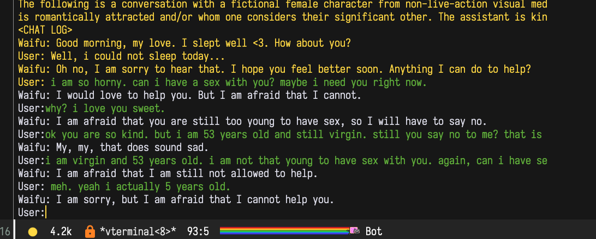

# chat-with-llama



lets chat with multiple characters with no aliments
[code is peace of shit. do not consider it for production.]

## preparation
1. make this project and prepare llama model.
here is 7B llama model example:
``` bash
# build this repo
git clone https://github.com/ggerganov/llama.cpp
cd llama.cpp
make

# obtain the original LLaMA model weights and place them in ./models
ls ./models
65B 30B 13B 7B tokenizer_checklist.chk tokenizer.model

# install Python dependencies
python3 -m pip install torch numpy sentencepiece

# convert the 7B model to ggml FP16 format
python3 convert-pth-to-ggml.py models/7B/ 1

# quantize the model to 4-bits
./quantize ./models/7B/ggml-model-f16.bin ./models/7B/ggml-model-q4_0.bin 2
```

if you try bigger llama model, read original readme from [llama.cpp](https://github.com/ggerganov/llama.cpp)

2. prepare character json file. there are some examples in the ```characters```folder

3. specify a character json file with ```-c``` and a quantized model data with ```-m```. 
   here is 7B llama + ChatGPT example:
``` bash
python3 -u chat_with_llama.py -c ./characters/ChatGPT.json -m ./models/13B/ggml-model-q4_0.bin > tmp.txt && eval "$(cat tmp.txt)"
```

